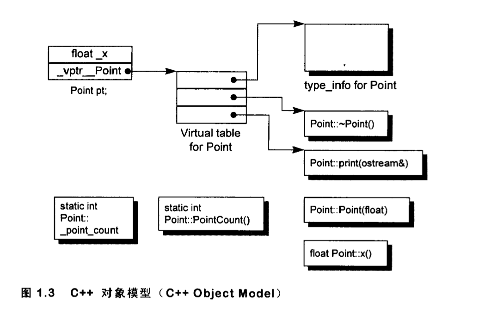
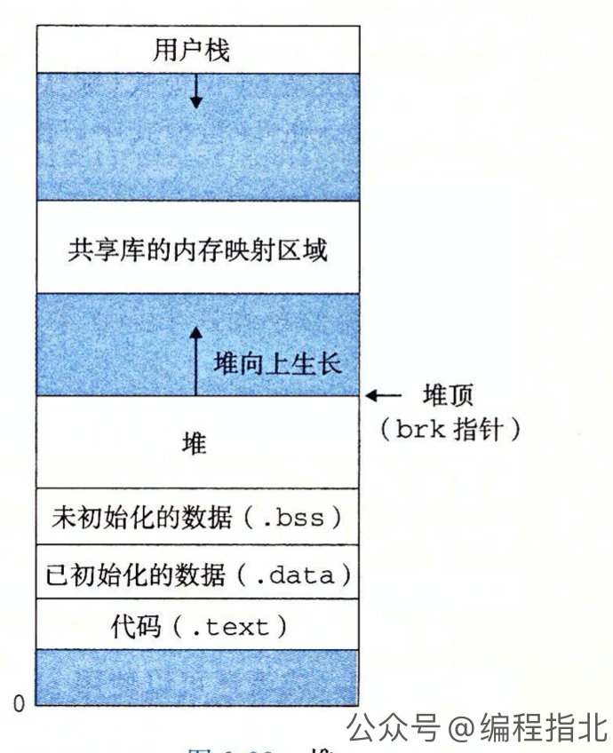

# 💻 语法基础
- [💻 语法基础](#-语法基础)
  - [🧱 C++基础](#-c基础)
    - [sizeof](#sizeof)
    - [strlen](#strlen)
    - [const 关键字](#const-关键字)
      - [1. 修饰变量](#1-修饰变量)
      - [2. 修饰函数参数](#2-修饰函数参数)
      - [3. 修饰函数返回值](#3-修饰函数返回值)
      - [4. 修饰指针或引用](#4-修饰指针或引用)
      - [5. 修饰成员函数](#5-修饰成员函数)
    - [static 关键字](#static-关键字)
      - [1. 修饰全局变量](#1-修饰全局变量)
      - [2. 修饰局部变量](#2-修饰局部变量)
      - [3. 修饰函数](#3-修饰函数)
      - [4. 修饰类成员变量和函数](#4-修饰类成员变量和函数)
    - [volatile 关键字](#volatile-关键字)
    - [内存/字节对齐](#内存字节对齐)
    - [字节序](#字节序)
    - [class 和 struct](#class-和-struct)
    - [宏定义（define）和内联函数（inline）的区别](#宏定义define和内联函数inline的区别)
    - [宏定义 (define) 和 typedef 的区别](#宏定义-define-和-typedef-的区别)
    - [explicit 关键字](#explicit-关键字)
    - [extern](#extern)
    - [extern C](#extern-c)
    - [mutable 关键字](#mutable-关键字)
    - [C++ 类型转换](#c-类型转换)
  - [🧬 C++ 面向对象](#-c-面向对象)
    - [重载、重写、隐藏](#重载重写隐藏)
    - [类对象的初始化和析构顺序](#类对象的初始化和析构顺序)
    - [深拷贝和浅拷贝](#深拷贝和浅拷贝)
      - [浅拷贝 (Shallow Copy)](#浅拷贝-shallow-copy)
      - [深拷贝 (Deep Copy)](#深拷贝-deep-copy)
    - [C++ 多态实现方式](#c-多态实现方式)
      - [1. 虚函数、纯虚函数实现多态](#1-虚函数纯虚函数实现多态)
      - [2. 模板函数多态](#2-模板函数多态)
      - [3. 函数重载多态](#3-函数重载多态)
    - [this 指针](#this-指针)
    - [C++ 虚函数表](#c-虚函数表)
    - [纯虚函数](#纯虚函数)
  - [🚚 C++ 内存管理](#-c-内存管理)
    - [指针](#指针)
      - [解引用](#解引用)
      - [指针数组](#指针数组)
      - [void 指针](#void-指针)
    - [指针声明](#指针声明)
    - [C/C++内存分区](#cc内存分区)
    - [指针和引用](#指针和引用)


## 🧱 C++基础
### sizeof
1. 指针的大小永远是固定的，取决于处理器位数，32位就是 4 字节，64位就是 8 字节
2. 数组作为函数参数时会退化为指针 (传递首地址指针，不知道长度)，大小要按指针的计算。
3. struct 结构体要考虑字节对齐。
4. 符串数组要算上末尾的 '\0'
5. `sizeof` 是一个 C++ 编译期间计算的操作符，用于计算数据类型或对象所占用的字节数。

### strlen

`strlen` 是一个 C 标准库中的函数 (`#include <cstring>`)，用于计算 C 风格字符串（以空字符 '\0' 结尾的字符数组）的长度，即不包括结尾的空字符的字符个数。

strlen 源代码如下:
```c
size_t strlen(const char *str) {
    size_t length = 0;
    while (*str++)
        ++length;
    return length;
}
```

### const 关键字

- 修饰变量、修饰函数参数、修饰函数返回值、修饰指针或引用、修饰成员函数
- 可以节省空间，避免不必要的内存分配
- `const` 定义常量从汇编的角度来看，只是给出了对应的内存地址，而不是像 `#define` 一样给出的是立即数。
- `const` 定义的常量在程序运行过程中只有一份拷贝，而 `#define` 定义的常量在内存中有若干个拷贝。
- 附加学习： [编译器是如何实现C/C++中的const的功能？](https://www.zhihu.com/question/386434272/answer/1140932735)


#### 1. 修饰变量

当 const 修饰变量时，该变量将被视为只读变量，即不能被修改。

这里的变量只读，其实只是编译器层面的保证，实际上可以通过指针在运行时去间接修改这个变量的值。  *例如*：对 `const int` 类型取指针，就是 `const int*` 类型的指针，将其强制转换为 `int*` 类型，就去掉了 `const` 限制，从而修改变量的值。

在 C++ 中，将 const 类型的指针强制转换为非const 类型的指针被称为类型强制转换（Type Casting），这种行为称为 `const_cast`。虽然可以这样操作，但这违反了 const的语义，可能会导致程序崩溃或者产生未定义行为(undefined behavior)，大家学习了解即可，实际编程中切莫如此操作。

因为编译器可能会做一些优化！！也就是在你用到 const 变量的地方，编译器可能生成的代码直接就替换为常量的值，而不是访问一遍常量的指令。 所以极大可能你虽然修改了值，但是却不起作用！例如
```cpp
const int a = 10;
const int* p = &a;
int* q = const_cast<int*>(p);
*q = 20;  // 通过指针间接修改 const 变量的值
std::cout << "a = " << a << std::endl;  // 输出 a 的值，结果为 10
```


#### 2. 修饰函数参数

`void func(const int a);` 函数参数 `a` 为只读变量，不能在函数内部修改其值。


#### 3. 修饰函数返回值

当 const 修饰函数返回值时，表示函数的返回值为只读，不能被修改。这样做可以使函数返回的值更加安全，避免被误修改。
```cpp
const int func() { int a = 10;  return a;}
```


#### 4. 修饰指针或引用

在 C/C++ 中，const 关键字可以用来修饰指针，用于声明指针本身为只读变量或者指向只读变量的指针。

根据 const 关键字的位置和类型，可以将 const 指针分为：
- `const int*`: **常量指针。** 指针可以修改（可以指向新的变量），但是不能通过指针修改所指向的变量。
- `int* const`: **指针常量。** 指针不能修改（不能指向其它变量），但是可以通过指针修改所指向的变量。
- `const int* const`: **只读指针指向只读变量。** 指针和其指向的值均不能修改
- `cosnt int&`: 常量引用

**4.1 常量指针**: 这种情况下，const 关键字修饰的是指针所指向的变量，而不是指针本身。**因此，指针本身可以被修改（意思是指针可以指向新的变量），但是不能通过指针修改所指向的变量。**
```cpp
const int* p;  // 声明一个指向只读变量的指针，可以指向 int 类型的只读变量
int a = 10;
const int b = 20;
p = &a;  // 合法，指针可以指向普通变量
p = &b;  // 合法，指针可以指向只读变量
*p = 30;  // 非法，无法通过指针修改只读变量的值
```

**4.2 指针常量**: const 关键字修饰的是指针本身，使得指针本身成为只读变量。**因此，指针本身不能被修改（即指针一旦初始化就不能指向其它变量），但是可以通过指针修改所指向的变量。**
```cpp
int a = 10;
int b = 20;
int* const p = &a;  // 声明一个只读指针，指向 a
*p = 30;  // 合法，可以通过指针修改 a 的值
p = &b;   // 非法，无法修改只读指针的值
```

**4.3 只读指针指向只读变量**: const 关键字同时修饰了指针本身和指针所指向的变量，使得指针本身和所指向的变量都成为只读变量。**因此，指针本身不能被修改，也不能通过指针修改所指向的变量。**
```cpp
const int a = 10;
const int* const p = &a;  // 声明一个只读指针，指向只读变量 a
*p = 20;      // 非法，无法通过指针修改只读变量的值
p = nullptr;  // 非法，无法修改只读指针的值
```

**4.4 常量引用**: 常量引用是指引用一个只读变量的引用，因此不能通过常量引用修改变量的值。
```cpp
const int a = 10;
const int& b = a;  // 声明一个常量引用，引用常量 a
b = 20;  // 非法，无法通过常量引用修改常量 a 的值
```


#### 5. 修饰成员函数

当 const 修饰成员函数时，表示该函数不会修改成员变量。

这样有个好处是，const 的对象就可以调用这些成员方法了，因为 const 对象不允许调用非 const 的成员方法。


### static 关键字

修饰 **全局变量**、**局部变量**、**函数**、**类成员变量和函数**

#### 1. 修饰全局变量

static 修饰全局变量可以**将变量的作用域限定在当前文件中，使得其他文件无法访问该变量**。 同时，**static 修饰的全局变量在程序启动时被初始化**（可以简单理解为在执行 **main() 之前**，会执行一个全局的初始化函数，在那里会执行全局变量的初始化），**生命周期和程序一样长**。
```cpp
// a.cpp 文件
static int a = 10;  // static 修饰全局变量
int main() {
    a++;  // 合法，可以在当前文件中访问 a
    return 0;
}

// b.cpp 文件
extern int a;  // 声明 a
void foo() {
    a++;  // 非法，会报链接错误，其他文件无法访问 a
}
```

#### 2. 修饰局部变量

static 修饰局部变量可以使得变量在**函数调用结束后不会被销毁，而是一直存在于内存中**，下次调用该函数时可以继续使用。

同时，**由于 static 修饰的局部变量的作用域仅限于函数内部**，所以**其他函数无法访问该变量**。

#### 3. 修饰函数

static 修饰函数可以将**函数的作用域限定在当前文件**中，使得**其他文件无法访问该函数**。

同时，由于 static 修饰的函数只能在当前文件中被调用，因此可以**避免命名冲突和代码重复定义**。

#### 4. 修饰类成员变量和函数

static 修饰类成员变量和函数可以使得它们**在所有类对象中共享，**且**不需要创建对象就可以直接访问**。


### volatile 关键字

`volatile` 是 C 语言中的一个关键字，用于**修饰变量**，**表示该变量的值可能在任何时候被「外部因素」更改，例如硬件设备、操作系统或其他线程**。

当一个变量被声明为 volatile 时，**编译器会禁止对该变量进行优化**，**以确保每次访问变量时都会从「内存」中读取其值，而不是从「寄存器或缓存」中读取**。

避免因为编译器优化而导致出现不符合预期的结果。

> [C++ 中 volatile 的作用](https://csguide.cn/cpp/basics/volatile.html#举例)


### 内存/字节对齐

当分配内存时，编译器会自动调整数据结构的内存布局，使得数据成员的起始地址与其自然对齐边界（一般为自己大小的倍数）相匹配。

**字节对齐有助于提高内存访问速度，因为许多处理器都优化了对齐数据的访问。** 但可能会导致内存中的一些空间浪费。底层原理看 [「到底为什么要内存对齐？ - b站」]([到底为什么要内存对齐？](https://www.bilibili.com/video/BV1aV4y1y7Sd/))

字节对齐规则
- **自然对齐边界**: 对于基本数据类型，其自然对齐边界通常为其大小。


- **结构体对齐**: 根据其最大对齐边界的成员进行对齐
  ```cpp
  //此代码在64位Linux下编写
  typedef struct _st_struct2
  {
    char  a; // 1 Byte 偏移量为0的地址处
    int   c; // 4 Byte 最大，按照4字节对齐，偏移量为4的地址处
    short b; // 2 Byte
  }st_struct2; // 12 Byte = 4(c的字节数) * 3
  // 0 1 2 3 4 5 6 7 8 9 10 11 内存布局
  // a _ _ _ c c c c b b _ _ _
  ```

- **联合体对齐**: 联合体的对齐边界取决于其最大对齐边界的成员。联合体的大小等于其最大大小的成员，因为联合体的所有成员共享相同的内存空间。

- **编译器指令**: 可以使用编译器指令（如 `#pragma pack`）更改默认的对齐规则。这个命令是全局生效的。这可以用于减小数据结构的大小，但可能会降低访问性能。

- **对齐属性**: 在 C++11 及更高版本中，可以使用 `alignas` 关键字为数据结构或变量指定对齐要求。这个命令是对某个类型或者对象生效的。例如，`alignas(16) int x;` 将确保 x 的地址是 16 的倍数。

- **动态内存分配**: 大多数内存分配函数 (如 `malloc` 和 `new`) 会自动分配足够对齐的内存，以满足任何数据类型的对齐要求。


### 字节序

字节序是指在多字节数据类型（如整数、浮点数等）中，字节在内存中的存储顺序。

主要有两种字节序：
- **大端字节序 (Big-endian)**: 高位字节存储在低地址处，低位字节存储在高地址处。
- **小端字节序 (Little-endian)**:低位字节存储在低地址处，高位字节存储在高地址处。
```
0x12345678 // 一个 4 字节的整数
| 0x12 | 0x34 | 0x56 | 0x78 | // 大端字节序 (符合人类的阅读习惯)
| 0x78 | 0x56 | 0x34 | 0x12 | // 小端字节序
```

> 判断系统的字节序的方法: 整数num值初始化为1（0x00000001）。然后将其指针类型从`int*`转换为`char*`，这样我们就可以访问该整数的第一个字节。
> - 如果系统是小端字节序，那么第一个字节是1
> - 如果系统是大端字节序，那么第一个字节是0

- 网络字节序，这是 TCP/IP 协议的规定，多字节数据在网络上传输时使用**大端**字节序。
- Windows (Inte x86 和 AMD x86_64) **小端**字节序
- Mac (Intel M1) **小端**字节序
- Linux 取决于硬件，大多数是**小端**字节序。PowerPC 大端字节序


### class 和 struct

C++ 中为了兼容 C 语言而保留了 C 语言的 struct 关键字，并且加以扩充了含义。
- C 语言中，struct 只能包含成员变量，不能包含成员函数。
- C++ 中，struct 类似于 class，既可以包含成员变量，又可以包含成员函数。

C++ 中的 struct 和 class 基本是通用的，唯有几个细节不同：
1. 默认成员属性: class private , struct public
2. 默认继承方式: class private , struct public 
3. class 可以用于定义模板参数，struct 不能(`template <struct T>`报错)

> 实际使用中，struct 我们通常用来定义一些 **POD(plain old data)**。POD是 C++ 定义的一类数据结构概念，比如 int、float 等都是 POD 类型的。    
> plain 代表它是一个普通类型，old 代表它是旧的，与几十年前的 C 语言兼容，那么就意味着可以使用 `memcpy()` 这种最原始的函数进行操作。    
> 两个系统进行交换数据，如果没有办法对数据进行语义检查和解释，那就只能以非常底层的数据形式进行交互，而拥有 POD 特征的类或者结构体通过二进制拷贝后依然能保持数据结构不变。也就是说，能用 C 的 `memcpy()` 等函数进行操作的类、结构体就是 POD 类型的数据。而 class 用于定义一些 非 POD 的对象，面向对象编程。


### 宏定义（define）和内联函数（inline）的区别

宏(macro)定义（`#define`）和内联函数（`inline`）都是为了减少函数调用开销和提高代码运行效率而引入的机制，但是它们的实现方式和作用机制略有不同。

一般用于定义宏（macro），主要有两种用途： **定义常量** 和 **创建宏函数** ，编译时替换文本
> 可以使用 gcc -E 选项查看宏替换后的结果。


内联函数的定义和普通函数类似，只需在函数声明前加上 inline 关键字即可。但是编译器并不一定会将所有声明为内联函数的函数都进行内联，是否内联取决于编译器的实现和优化策略。

由于函数体会被复制多次，会占用更多的代码段空间，而且在某些情况下可能会导致代码膨胀。

- 宏定义就是单纯的字符替换，不涉及类型检查。 内联函数会进行类型检查，更加安全。
- 内联函数可以进行调试，宏定义的“函数”无法调试。


### 宏定义 (define) 和 typedef 的区别

1. 语法和实现机制不同
   - 宏定义 `#define` 在编译期间将**宏展开**，并替换宏定义中的代码。**预处理器**只进行简单的文本替换，不涉及类型检查。
   - `typedef` 是一种类型定义关键字，用于为现有类型创建新的名称（别名）。与宏定义不同，typedef 是在**编译阶段处理**的，有更严格的类型检查。
2. 作用域限制
   - 宏定义没有作用域限制，只要在宏定义之后的地方，就可以使用宏。
   - typedef 遵循 C++ 的作用域规则，可以受到命名空间、类等结构的作用域限制。
3. 模板支持
   - 宏定义不支持模板，因此不能用于定义模板类型别名。
   - typedef 可以与模板结合使用，但在 C++11 之后，推荐使用 using 关键字定义模板类型别名。
      ```cpp
      // 使用 typedef 定义模板类型别名
      template <typename T>
      struct MyContainer {
          typedef std::vector<T> Type;
      };

      // 使用 using 定义模板类型别名（C++11 及以后）
      template <typename T>
      struct MyContainer {
          using Type = std::vector<T>;
      };
      ```

### explicit 关键字
用于防止隐式转换。 当将一个参数传递给构造函数时，如果构造函数声明中使用了 explicit 关键字，则只能使用显式转换进行转换，而不能进行隐式转换。

```cpp
class MyInt {
public:
    MyInt(int n) : num(n) {}
private:
    int num;
};

// 注意，这段代码有两个步骤：
// 1. int 类型的 10 先隐式类型转换为 MyInt 的一个临时对象 
//    (编译器会用复制省略（copy elision）优化这段代码)
// 2. 隐式类型转换后的临时对象再通过复制构造函数生成 a
MyInt a = 10; 

void f(MyInt n){}
f(10); // 编译通过，因为编译器会将 int 类型的值隐式转换为 MyInt 类型的对象。
```
但或许，有些情况下，我们并不期望 f 函数可以接受一个 int 类型的参数，这是预期外的，可能会导致错误的结果。那么如果希望只接受 MyInt 类型的参数，就可以将构造函数声明加上 explicit：
```cpp
class MyInt {
public:
    explicit MyInt(int n) : num(n) {}
private:
    int num;
};
MyInt a = 10; // 报错
void f(MyInt n){}
f(10);        // 报错， explicit 不能隐式转换
f(MyInt(10)); // 正确，显式转换
```

> Google C++ 代码规范中的说明了这种情况的缺点：[3.2. 隐式类型转换](https://zh-google-styleguide.readthedocs.io/en/latest/google-cpp-styleguide/classes/#section-3)。 **尤其是构造函数参数只有一种类型的，强烈建议加上 explicit**

### extern

C++ 全局变量的作用范围仅限于**当前的文件**，但同时C++也支持分离式编译，允许将程序分割为若干个文件被独立编译。于是就需要在**文件间共享变量数据**，这里 `extern` 就发挥了作用。

`extern` 用于**指示「变量」或「函数」的定义在另一个源文件中，并在当前源文件中声明**。 说明该符号具有外部链接(external linkage)属性。
> 也就是告诉编译器: 这个符号在别处定义了，你先编译，到时候链接器会去别的地方找这个符号定义的地址。

```cpp
extern int global_var;// 声明，使用 extern 关键字告诉编译器它的定义在其他源文件
int global_var = 42;  // 定义
```

C++ 语言规定有以下链接属性
1. **外部链接（External Linkage）**: 可以在**不同的源文件之间共享**，并且在整个程序执行期间可见。全局变量和函数都具有外部链接。
2. **内部链接（Internal Linkage）**:内部链接的符号**只能在当前源文件内部使用**，不能被其他源文件访问。**用 `static` 修饰的全局变量和函数具有内部链接**。
3. **无链接（No Linkage）**: 无链接的符号只能在**当前代码块（函数或代码块）内部使用**，不能被其他函数或代码块访问。用 `const` 或 `constexpr` 修饰的常量具有无链接属性（ 通常情况下编译器是不会为 const 对象分配内存，也就无法链接）。
4. **外部 C 链接（External C Linkage）**: 外部 C 链接的符号与外部链接类似，可以在不同的源文件之间共享，并且在整个程序执行期间可见。它们具有 C 语言的名称和调用约定，可以与 C 语言编写的代码进行交互。
   在 C++ 中，可以用 `extern "C"` 关键字来指定外部 C 链接，从而使用一些 C 的静态库。

> 这些链接属性可以通过关键字 extern、static、const 和 extern "C" 来显式地指定。

extern 作用
1. **声明变量但不定义**: 声明变量或函数的存在，但不进行定义，让编译器在链接时在其他源文件中查找定义。不同的源文件可以共享相同的变量或函数。
   
   ```cpp
   // fileA.cpp
   int i = 1;       // 声明并定义全局变量i

   // fileB.cpp
   extern int i;    // 声明i，链接全局变量

   // fileC.cpp
   extern int i = 2;// 错误，多重定义
   int i;           // 错误，这是一个定义，导致多重定义
   main()
   {
       extern int i;// 正确
       int i = 5;   // 正确，新的局部变量i;
   }
   ```

2. **常量全局变量的外部链接**: 全局常量默认是内部链接的，所以想要在文件间传递全局常量量需要在定义时指明extern
   ```cpp
   //fileA.cpp
   extern const int i = 1;        //定义

   //fileB.cpp                    //声明
   extern const int i;
   ```
   而下面这种用法则会报链接错误，找不到 i 的定义:
   ```cpp
   //fileA.cpp
   const int i = 1;        //定义 (不用 extern 修饰)

   //fileB.cpp                    //声明
   extern const int i;
   ```

3. **编译和链接过程**: 编译链接过程中，extern 的作用如下：
   - 在**编译期**，`extern` 用于告诉编译器某个变量或函数的定义在其他源文件中，编译器会为它生成一个符号表项，并在当前源文件中建立一个对该符号的引用。这个引用是一个未定义的符号，编译器在后续的链接过程中会在其他源文件中查找这个符号的定义。
   - 在**链接期**，链接器将多个目标文件合并成一个可执行文件，并且在当前源文件中声明的符号，会在其它源文件中找到对应的定义，并将它们链接起来。

### extern C

`extern` 是指示链接可见性和符号规则，而 `extern "C"` 则是 C++ 语言提供的一种机制，用于在 C++ 代码中调用 C 语言编写的函数和变量。

如果不用 `extern "C"` ，由于 C++ 和 C 语言在**编译和链接时使用的命名规则不同**，这会导致 C++ 代码无法调用 C 语言编写的函数或变量（链接时找不到符号）。

简单解释一下什么**是函数的命名规则**：对于 C++ 语言，由于需要支持重载，所以一个函数的链接名（Linkage Name）是由函数的名称、参数类型和返回值类型等信息组成的，用于在编译和链接时唯一标识该函数。

函数的链接名的生成规则在不同的编译器和操作系统上可能有所不同，一般是由编译器自动处理，不需要手动指定，这个规则常常叫做 "Name Mangling":
- **Microsoft Visual C++ 编译器（Windows）**：函数的名称会被编译器修改为一个以 "_" 开头的名称，并加上参数类型和返回值类型等信息，以避免链接冲突。例如，函数 `int add(int a, int b)` 的链接名可能是 `_add_int_int。`
- **GCC 编译器（Linux）**：也会加上参数类型和返回值类型等信息。例如，函数 `int add(int a, int b)` 的链接名可能是 `_Z3addii`。
- **Clang 编译器（MacOS）**：函数的链接名的生成规则与 GCC 编译器类似，但稍有不同。例如，函数 `int add(int a, int b)` 的链接名可能是 `_Z3addii`。

而 C 语言的链接函数名规则又和 上面三个 C++ 不一样，通过在 C++ 代码中使用 extern "C" 关键字，可以将 C++ 编译器的命名规则转换为 C 语言的命名规则，从而使得 C++ 代码可以调用 C 语言的函数或变量。

```cpp
extern "C" {
    // C 语言函数或变量的声明
}
```


### mutable 关键字

mutable是C++中的一个关键字，用于修饰类的成员变量，表示该成员变量即使在一个const成员函数中也可以被修改。

mutable的中文意思是“可变的，易变的”，跟constant（既C++中的const）是反义词

因为在C++中，如果一个成员函数被声明为const，那么它不能修改类的任何成员变量，除非这个成员变量被声明为mutable。

### C++ 类型转换

在 C 语言中，我们大多数是用 (type_name) expression 这种方式来做强制类型转换，但是在 C++ 中，更推荐使用四个转换操作符来实现显式类型转换 `运算符 <new_type> (expression)` ：
- **`static_cast`**: 和 C 语言 () 做强制类型转换基本是等价的。在**编译时执行类型转换**，在进行指针或引用类型转换时，需要自己保证合法性
  1. 基本类型之间的转换
  ```cpp
  int a = 42;
  double b = static_cast<double>(a); // 将整数a转换为双精度浮点数b
  ```
  1. 指针(引用)类型之间的转换: 在类层次结构中从基类指针转换为派生类指针。这种转换不执行运行时类型检查，可能不安全
  ```cpp
  class Base {};
  class Derived : public Base {};

  Base* base_ptr = new Derived();
  // 将基类指针base_ptr转换为派生类指针derived_ptr
  Derived* derived_ptr = static_cast<Derived*>(base_ptr); 
  ```

- **`dynamic_cast`**: 主要应用于父子类层次结构中的安全类型转换。在**运行时执行类型检查**，因此相比于`static_cast`，它更加安全。
  1. 向下类型转换: 当需要将「基类指针或引用」转换为「派生类指针或引用」时，dynamic_cast可以确保类型兼容性。如果转换失败，dynamic_cast将返回空指针（对于指针类型）或抛出异常（对于引用类型）。
  ```cpp
  class Base { virtual void dummy() {} };
  class Derived : public Base { int a; };

  Base* base_ptr = new Derived();
  Derived* derived_ptr = dynamic_cast<Derived*>(base_ptr); // 将基类指针base_ptr转换为派生类指针derived_ptr，如果类型兼容，则成功
  ```
  2. 多态类型检查
  > 要使用dynamic_cast有效，基类至少需要一个虚拟函数。因为，dynamic_cast只有在基类存在虚函数(虚函数表)的情况下才有可能将基类指针转化为子类。

  dynamic_cast的底层原理依赖于运行时类型信息（RTTI, Runtime Type Information）。C++编译器在编译时为支持多态的类生成RTTI，它包含了类的类型信息和类层次结构。

  我们都知道当使用虚函数时，编译器会为每个类生成一个虚函数表（vtable），并在其中存储指向虚函数的指针。伴随虚函数表的还有 RTTI(运行时类型信息)，这些辅助的信息可以用来帮助我们运行时识别对象的类型信息。 具体查看 ["dynamic_cast 底层原理"](https://csguide.cn/cpp/basics/type_conversions.html#_2-3-dynamic-cast-底层原理)
  

- **`const_cast`**: `new_type` 必须是一个**指针**、**引用**或者**指向对象类型成员的指针**。
  1. 当需要修改const对象时，可以使用const_cast来删除const属性。
  2. 当需要使用const对象调用非const成员函数时，可以使用const_cast删除对象的const属性。


- **`reinterpret_cast`**: 不同类型之间进行**低级别的转换** (interpret是“解释，诠释”的意思，加上前缀“re”，就是“重新诠释”的意思，cast 在这里可以翻译成“转型”)

  它仅仅是重新解释底层比特（也就是对指针所指针的那片比特位换个类型做解释），而不进行任何类型检查。

  在某些情况下，需要在不同指针类型之间进行转换，如将一个int指针转换为char指针。

  > 详细阅读 https://zhuanlan.zhihu.com/p/33040213


## 🧬 C++ 面向对象


### 重载、重写、隐藏

- 重载（Overloading）: 
  1. 方法具有相同的名称。
  2. 方法具有不同的参数类型或参数数量。
  3. 返回类型可以相同或不同。
  4. 同一作用域，比如都是一个类的成员函数，或者都是全局函数
- 重写（Overriding）: 
  1. 方法具有相同的名称。
  2. 方法具有相同的参数类型和数量。
  3. 方法具有相同的返回类型。
  4. 重写的基类中被重写的函数必须有virtual修饰。
  5. 重写主要在继承关系的类之间发生。
- 隐藏（Hiding）: 隐藏是指派生类的函数屏蔽了与其同名的基类函数。注意只要同名函数，不管参数列表是否相同，基类函数都会被隐藏。 。

### 类对象的初始化和析构顺序

**类的析构顺序和构造顺序完全相反，先构造的对象后析构，后构造的对象先析构。** 

1. **基类初始化顺序**：如果当前类继承自一个或多个基类，它们将按照声明顺序进行初始化（先初始化基类），但是在有虚继承和一般继承存在的情况下，优先虚继承。
2. **成员变量初始化顺序**：类的成员变量按照它们在类定义中的声明顺序进行初始化（这里一定要注意，成员变量的初始化顺序只与声明的顺序有关！！）。
3. **执行构造函数**：在基类和成员变量初始化完成后，执行类的构造函数。


### 深拷贝和浅拷贝

#### 浅拷贝 (Shallow Copy)
仅复制对象的基本类型成员和指针成员的值，而不复制指针所指向的内存。
  - 这可能导致两个对象共享相同的资源，从而引发潜在的问题，如内存泄漏、意外修改共享资源等。
  - 一般来说编译器**默认**帮我们实现的**拷贝构造函数**就是一种**浅拷贝**。

#### 深拷贝 (Deep Copy)

不仅复制对象的基本类型成员和指针成员的值，还复制指针所指向的内存。
  - 因此，两个对象不会共享相同的资源，避免了潜在问题。
  - 深拷贝通常需要显式实现拷贝构造函数和赋值运算符重载。

```cpp
class MyClass {
    char* data;
public:
    // 深拷贝的拷贝构造函数
    MyClass(const MyClass& other) {
        // 以 \0 结尾，但是长度计算不包含 \0
        data = new char[strlen(other.data) + 1];
        strcpy(data, other.data);
    }
    // 深拷贝的赋值运算符重载
    MyClass& operator=(const MyClass& other) {
        if (this == &other)  return *this;
        delete[] data;
        data = new char[strlen(other.data) + 1];
        strcpy(data, other.data);
        return *this;
    }
};
```

### C++ 多态实现方式

C++中的多态是指同一个函数或者操作在不同的对象上有不同的表现形式。

C++实现多态的方法主要包括**虚函数**、**纯虚函数**和**模板函数**、

> `virtual` 关键字只用在类定义里的函数声明中，写函数体时不用。

#### 1. 虚函数、纯虚函数实现多态

C++ 的多态必须满足两个条件：

1. 必须**通过基类的「指针或者引用」调用虚函数**
2. **被调用的函数是虚函数**，且必须完成**对基类虚函数的重写**

> 设计模型中的应用

其中第一条很重要，当我们使用**派生类的指针去访问/调用虚函数**时，实际上并未发生动态多态，因**为编译时就能确定对象类型为派生类型**，然后直接生成调用派生类虚函数的代码即可，这种叫做**静态绑定**。

通过**基类的指针或引用调用虚函数**才能构成多态，因为这种情况下**运行时**才能确定对象的实际类型，这种称为**动态绑定** ，例如
```cpp
// 基类
class CFather {
public : virtual void Fun() { } // 虚函数
};
// 派生类
class CSon : public CFather { 
public : virtual void Fun() { }
};
int main() {
    CSon son;
    CFather *p = &son;
    p->Fun(); //调用哪个虚函数取决于 p 指向哪种类型的对象
    return 0;
}
```

#### 2. 模板函数多态

模板函数可以根据传递参数的不同类型，自动生成相应类型的函数代码。模板函数可以用来实现多态。

#### 3. 函数重载多态

静态多态还包括了函数重载。  `dynamic_cast` 和 `typeid` 运算符也可以用于静态多态。


### this 指针

**`this` 是一个指向当前对象的指针。** 本质上是成员函数的局部变量


在**常量成员函数**（const member function）中，`this` 指针的类型是**指向常量对象的常量指针**（const pointer to const object），因此不能用来修改成员变量的值。

### C++ 虚函数表

1. 每一个类产生出一堆指向**虚函数**的指针，放在**虚函数表 (virtual table, V-Table)**，存放的是「**一个类的虚函数的地址表**」
2. 每一个类对象被安插一个指针，指向相关的虚函数表。通常这个指针被称为 `vptr`      
   `vptr` 的**设定**和**重置**都由每一个类的构造、析构、拷贝复制自动完成。每一个类所关联的 `type_info` 对象（用以支持 runtime type identification, RTTI）也经由虚函数表被指出来，通常放在表格的第一个位置 slot
3. **虚表是属于类的**，而不是属于某个具体的对象，一个类只需要一个虚表即可。同一个类的所有对象都使用同一个虚表。


详细阅读 [「C++ 虚函数表剖析」](https://zhuanlan.zhihu.com/p/75172640)

```cpp
class roint {
public:
	Point(float val); 
	virtoal ~Point();
	float x() const,
	static int PointCount();
protected:
	virtual ostream& print( ostream &os ) const;
	float _x;
	static int _point_count;
};
```


> 上图是《深度探索C++对象模型》第一章介绍的 C++的对象模型: [https://github.com/imarvinle/awesome-cs-books](https://github.com/imarvinle/awesome-cs-books)

一个**对象**在内存中一般由**成员变量（非静态）**、**虚函数表指针(`vptr`)** 构成。而非静态变量/函数在对象外

`vptr` 指向一个数组，**数组的元素就是各个虚函数的地址**，通过函数的索引，我们就能直接访问对应的虚函数。
> 如果用到 RTTI 的功能，其信息也被放到 vtbl 之中

**❓「问」** 需要多少内存才能够表现一个class object？<sup>[《深度探索C++对象模型》读书笔记](https://zhuanlan.zhihu.com/p/369495063)</sup>     
一般而言要有：
- **非静态成员变量**的总和大小
- 加上任何由于**内存对齐**的需求而填补的空间
- 加上为了支持 `virtual` 而由内部产生的任何额外负担


### 纯虚函数

- 虚函数是一种在基类中**声明但没有实现**的虚函数。
- 包含纯虚函数的类称为抽象类（Abstract Class）。
- 抽象类无法实例化，也就是无法创建对象。(原因很简单，纯虚函数没有函数体，不是完整的函数，无法调用，也无法为其分配内存空间。)
```cpp
class Shape {
public:
   virtual void draw() = 0; // 纯虚函数
};
```

**❓「问」** 为什么**构造函数**不能是虚函数？

1. **从语法层面来说** 。
   - 虚函数的主要目的是实现多态，即允许在派生类中覆盖基类的成员函数。但是，构造函数负责初始化类的对象，每个类都应该有自己的构造函数。
   - 在派生类中，基类的构造函数会被自动调用，用于初始化基类的成员。因此，构造函数没有被覆盖的必要，不需要使用虚函数来实现多态。
2. **从虚函数表机制回答** 。
   - 虚函数使用了一种称为虚函数表（vtable）的机制。
   - 在**「调用构造函数时，对象还没有完全创建和初始化，所以虚函数表可能尚未设置」**。这意味着在**构造函数中使用虚函数表会导致未定义的行为**。
   - 只有**执行完了对象的构造，虚函数表才会被正确的初始化**。


**❓「问」** 为什么**基类析构函数**需要是虚函数？

析构函数是进行类的清理工作，比如释放内存、关闭DB链接、关闭Socket等等，
```cpp
Base* ptr = new Derived();
delete ptr; // 只会调用Base的析构函数，Derived的析构函数不会被调用
```
这种情况下导致了**基类析构函数**必须是虚函数，由子类覆盖并完成清理工作，否则会导致**内存泄漏**。

**❓「问」** 为什么默认的析构函数不是虚函数？

因为，虚函数不同于普通成员函数，当类中有虚成员函数时，类会自动进行一些额外工作。这些额外的工作包括**生成虚函数表**和**虚表指针**，其中虚表指针指向虚函数表。这样一来，就会占用额外的内存，**当定义的类不被其他类继承时，这种内存开销无疑是浪费的**。

当创建一个类时，系统默认我们不会将该类作为基类，所以就将默认的析构函数定义成非虚函数，这样就不会占用额外的内存空间。     
同时，系统也相信程序开发者在定义一个基类时，会显示地将基类的析构函数定义成虚函数，此时该类才会维护虚函数表和虚表指针。


**❓「问」** 为什么**成员模板函数**不能是虚函数？

问题的意思是，为什么在C++里面，一个类的成员函数不能既是 `template` 又是 `virtual` 的。比如，下面的代码编译会报错
```cpp
class Animal{
  public:
      template<typename T>
      virtual void make_sound();
};
```

这个问题涉及到一点 C++ 的实现机制（C++中模板是如何工作的、虚拟函数是如何实现的、编译器和链接器如何从源代码生成可执行文件），所以很少人能一下子答上来。

具体理由如下:  因为C++的**编译与链接模型**是"分离"的(至少是部分原因吧)。
- 从Unix/C开始，一个C/C++程序就可以被分开编译，然后用一个linker链接起来。这种模型有一个问题，就是**各个编译单元可能对另一个编译单元一无所知**。
- 一个函数最后到底会被实例化为多少个函数，要等整个程序(所有的编译单元)全部被编译完成才知道。
- 同时，虚函数的实现大多利用了一个"虚函数表"（参考: [虚函数机制](http://localhost:1024/cpp/object_oriented/virtual_function.html)）的东西，这种实现中，**一个类的内存布局(或者说虚函数表的内存布局)需要在这个类编译完成的时候就被完全确定**。

所以当一个虚拟函数是模板函数时，编译器在编译时无法为其生成一个确定的虚函数表条目，因为模板函数可以有无数个实例。但是编译时无法确定需要调用哪个特定的模板实例。因此，C++标准规定 member function 不能既是 template 又是 virtual 的。

参考: [https://www.zhihu.com/question/60911582/answer/182045051](https://www.zhihu.com/question/60911582/answer/182045051)


## 🚚 C++ 内存管理


### 指针

- 指针本身也是一个变量，需要内存去存储，指针也有自己的地址
- 指针内存存储的是它所指向变量的地址

#### 解引用

```cpp
float f = 1.0;
short c = *(short*)&f; 
// &f       取首位地址 
// (short*) 转化为2字节的指针
// *        取2字节的值
```
你能解释清楚上面过程，对于 `f` 变量，在内存层面发生了什么变化吗？或者 `c` 的值是多少？1 ？实际上，**从内存层面来说，`f` 什么都没变。**

```cpp
// float f = 1.0 ; 的内存布局 4 Byte (32 bit)
// float :  1 bit 符号位 , 8 bit 指数位 , 23 bit 尾数位 (7位有效数字)
| 0000 0000 | 1000 0000 | 0000 0000 | 0000 0000 |  // (大端为例)
|    0x00   |    0x7f   |   0x00    |   0x00    |  // f
|    0x00   |    0x7f   |                          // c
```
> **指数位**: 用于存储科学计数法中的指数数据，并且采用移位存储

如果反过来，那么就可能发生 **coredump(堆芯转储)**，也就是访存失败。就算是不会 coredump，这种也会破坏这块内存原有的值，
```cpp
short c = 1;
float f = *(float*)&c;
```

#### 指针数组

实际上可以看做 `address[offset]`，`address` 为起始地址，`offset` 为偏移量: `address + sizeof(int) * offset`。 这是汇编中寻址方式的一种：**基址变址寻址** (`MOV AX , [ BX + SI ]`)。

访问二维数组 `array[n][m]` 中的 `array[a][b]`:  `array + (m * a + b)`


#### void 指针

在这些情况下，void 表达的意思就是没有返回值或者参数为空。但是对于 void 型指针却表示通用指针，可以用来存放任何数据类型的引用。
```cpp
void func();
int func1(void);
```

void 指针最大的用处就是在 C 语言中实现泛型编程，因为任何指针都可以被赋给 void 指针，void 指针也可以被转换回原来的指针类型， 并且这个过程指针实际所指向的地址并不会发生变化。

void 还可以用来实现 C 语言中的多态，这是一个挺好玩的东西。

但是 **不能对 void 指针解引用**

### 指针声明

```cpp
int (*(*p)[5])(int); 
```
- **指针数组**: `int *p[3]` 。  `p` 先与 `[]` 结合，因为其优先级比高，所以 `p` 是一个数组。然后再与 `*` 结合，说明**数组里的元素是指针类型**。之后再与 `int` 结合，说明指针所指向的内容的类型是整型的，所以 `p` 是一个指向 `int` 的指针数组。
- **数组指针**: `int (*p)[3]` 。 指向 int 数组(大小为3)的指针
- **函数声明**: `int p(int);`
- **函数指针**: `int (*p)(int);`


### C/C++内存分区

程序运行时，代码、数据等都存放在不同的内存区域，这些内存区域从逻辑上做了划分，大概以下几个区域：
- **代码区**(Code Segment): `.text` 段。存放二进制代码，只读
- **全局/静态存储区**(Global/Static Storage): `.bss` 和 `.data` 段
  - 以前在 C 语言中全局变量又分为**初始化**的和**未初始化**的，分别放在上面图中的 `.bss` 和 `.data` 段，但在 C++里面没有这个区分了，他们共同占用同一块内存区，就叫做全局存储区。
- **栈区**(Stack): 栈区用于存储函数调用时的局部变量、函数参数以及返回地址。
- **堆区**(Heap): 动态内存分配的区域，当使用 `new` 或者 `malloc` 分配内存时，分配的内存块就位于堆区。需要手动释放这些内存，否则可能导致内存泄漏
- **常量区**(Constant Storage): 字符串字面量和其他编译时常量。这个区域通常也是只读的





### 指针和引用

要是问引用和指针有什么区别，相信大多数学过c++的都能回答上几点: 指针是所指内存的地址，引用是别名，引用必须初始化。。。。。

但是引用是别名这是c++语法规定的语义，那么到底引用在汇编层面和指针有什么区别呢？

没区别。

对，引用会被c++编译器当做const指针来进行操作。


